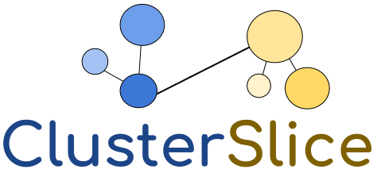

<p align="center">
    
</p>

# ClusterSlice Documentation

## Table of Contents

- [Simple Example](#simple-example)
- [Declarative Definition of Experimentation Slices](#declarative-definition-of-experimentation-slices)
  - [Global Properties](#global-properties)
  - [Infrastructure Configuration](#infrastructure-configuration)
  - [Kubernetes Configuration](#kubernetes-configuration)
  - [Application Modules Configuration](#application-modules-configuration)
  - [Experimentation Automation](#experimentation-automation)
- [Design and Implementation Details](#design-and-implementation-details)
  - [Basic ClusterSlice Architecture](#basic-clusterslice-architecture)
  - [Multi-Clustering and Multi-Domain Capabilities](#multi-clustering-and-multi-domain-capabilities)
  - [ClusterSlice Security](#clusterslice-security)
  - [Open-Source Projects Acknowledgement](#open-source-projects-acknowledgement)

## Simple Example

ClusterSlice can transform test-bed resources from bare-metal or hypervisor setups into fully-operational Kubernetes slices. For instance, ClusterSlice test-bed users may execute the following command:

```console
user@boss:~/clusterslice/examples$ kubectl apply -f slicerequest.yaml
```

After a while, they will have their own test-bed slice, similar to those in SLICES (i.e., Fed4FIRE+) or EdgeNet test-beds.

An example ClusterSlice request file, such as [slicerequest.yaml](../examples/slicerequest.yaml), is provided below:

```YAML
apiVersion: "swn.uom.gr/v1"
kind: SliceRequest
metadata:
  name: clusterslice
  namespace: swn
spec:
  name: clusterslice
  usernamespace: swn
  credentials:
    username: clusterslice
    password: sha-512-encoded-password
  infrastructure:
    masters:
      count: 1
      osimage: "ubuntu-22-clean"
      mastertype: "vm"
    workers:
      count: 5
      osimage: "ubuntu-22-clean"
      workertype: "vm"
  kubernetes:
    kubernetestype: "vanilla"
    version: "1.1"
    networkfabric: "flannel"
  applications:
    - name: argo
      version: "v3.4.4"
      parameters: "{'workflow': 'daemon-nginx.yaml'}"
      scope: cluster
    - name: helm
      scope: cluster
    - name: metrics-server
      version: "latest"
      scope: cluster
    - name: dashboard
      version: "v2.7.0"
      scope: cluster
    - name: kubeview
      scope: cluster
    - name: docker
      scope: all
```

In this custom resource, a vanilla Kubernetes cluster of version 1.1 is requested, with Flannel as the networking fabric. The test-bed allocates 1 master and 5 worker VMs running Ubuntu 22.04. After allocation, an Argo workflow named daemon-nginx.yaml is deployed, along with other applications.

To check the status of the request, the following command can be used:

```console
user@boss:~/clusterslice/examples$ kubectl get slicerequests
``` 

Once the request is accepted, the corresponding slice can be viewed:

```console
user@boss:~/clusterslice/examples$ kubectl get slices
```

One can see in the slice the number of master and worker nodes being succesfully allocated, as well the status and a recent output message of the slice.

For detailed resource status, including nodes and controllers (global test-bed resources belong in swn namespace):

```console
user@boss:~/clusterslice/examples$ kubectl get computeresources -n swn
```

At this point, the following status states are supported for the computeresources:

* **free:** the resource is free to be used.
* **reserved:** the resource is reserved to a slice to be used.
* **creating_vm:** a VM is being created.
* **booting:** the resource is currently booting.
* **os_ready:** the OS is installed.
* **os_configured:** the OS is configured.
* **os_completed:** A non-k8s node is allocated.
* **kubernetes_base:** Kubernetes base tools are installed in the resource.
* **wait_for_plugin:** Waiting for network fabric deployment to be completed.
* **kubernetes_master:** The resource is a kubernetes master node.
* **join_worker:** Worker node is joining the cluster.
* **kubernetes_worker:** The resource is a kubernetes worker node.
* **allocated:** The resource is now fully allocated, including its apps been installed.
* **failed:** There is a failure in the node deployment process.

This is the typical flow of a node state machine, in a new slice deployment.

More details can be found in the yaml file defining the computeresoures custom resource, i.e., file [computeresources-crd.yaml](../crds/computeresources-crd.yaml).

The user can execute the following command to remove an existing slice, e.g., for a slice request described in file slicerequest.yaml:

```console
user@boss:~/clusterslice/examples$ kubectl delete -f slicerequest.yaml
```

The removal of slice request object triggers a cascading deletion of all other relevant resources, including the associated VMs.

## Declarative Definition of Experimentation Slices

Here, we provide an exhaustive list of parameters for declaring an experimentation slice request using the `SliceRequest` Kubernetes custom resource. Further details about the `SliceRequest` object can be found in the [slicerequest-crd.yaml](../crds/slicerequest-crd.yaml) file.

Experimentation slice requests can be defined directly by users or through a higher-level abstraction called the "multicluster slice request" custom resource, which facilitates multi-domain and multi-cluster experimentation.

The slice request objects can have the following status states:
* **defined:** The slice request has been defined.
* **accepted:** The slice request has been accepted and a slice object has been created.
* **failed:** The slice request has failed.
* **deploying_nodes:** The slice request involves deploying physical nodes, as in open test-bed deployments.
* **declined:** The slice request has been declined.

The `SliceRequest` specification consists of four parts: global properties, infrastructure configuration demands, Kubernetes configuration, and applications configuration.

### Global Properties

The available global properties, along with descriptions, parameter types/options, and implementation status, are listed in the table below:

| Parameters           | Type / Options         | Description                                        | Implementation Status  |
| -------------------- | ---------------------- | -------------------------------------------------- | ---------------------- |
| name                 | string                 | Slice name                                         | Available              |
| duration             | string                 | Slice duration                                     | In Progress            |
| usernamespace        | string                 | User namespace                                     | Available              |
| deploymentstrategy   | firstone, balanced     | VM deployment strategy over multiple servers       | More options to follow |
| deploymentdomain     | string                 | Deployment domain selection in multi-domain setups | Available              |
| credentials.username | string                 | Slice admin username                               | Available              |
| credentials.password | SHA-512 encoded string | Encoded slice admin password                       | Available              |
| updating             | boolean                | Whether node update packages after deployment      | In Progress            |

To create the encoded password, you can use the following command (requires the `mkpasswd` tool):

```console
user@boss:~/clusterslice/examples$ mkpasswd --method=sha-512
```

The above command can be installed with the package whois, in the case of ubuntu distribution.

### Infrastructure Configuration

The infrastructure configuration is defined under the "infrastructure" field of the `SliceRequest` custom resource. It allows specifying requirements for three types of nodes: regular non-Kubernetes nodes, master nodes, and worker nodes.

The corresponding parameters are listed below:

| Parameters           | Type / Options                 | Description                                    | Implementation Status |
| -------------------- | ------------------------------ | ---------------------------------------------  | ----------------------|
| nodes.count          | integer                        | Number of non-Kubernetes nodes                 | Available             |
| nodes.osimage        | string                         | OS image of non-Kubernetes nodes               | More images to follow |
| nodes.osaccount      | string                         | Initial admin account for non-Kubernetes nodes | Available             |
| nodes.nodetype       | vm, node, or testbed node type | Type of non-Kubernetes nodes                   | Available             |
| masters.count        | integer                        | Number of master nodes                         | Available             |
| masters.osimage      | string                         | OS image of master nodes                       | More images to follow |
| masters.osaccount    | string                         | Initial admin account for master OS            | Available             |
| masters.mastertype   | vm, node, or testbed node type | Type of master nodes                           | Available             |
| workers.count        | integer                        | Number of worker nodes                         | Available             |
| workers.osimage      | string                         | OS image for worker nodes                      | More images to follow |
| workers.osaccount    | string                         | Initial admin account for worker OS            | Available             |
| workers.workertype   | vm, node, or testbed node type | Type of worker nodes                           | Available             |

The requested nodes can be implemented over heterogeneous virtual and physical resources, including from VirtualBox, XCP-NG cloud systems and CloudLab open test-bed.

### Kubernetes Configuration

When a `SliceRequest` specifies Kubernetes master and worker nodes, a Kubernetes configuration can be defined under the "kubernetes" field. The configuration parameters are as follows:

| Parameters           | Type / Options                   | Description                             | Implementation Status  |
| -------------------- | -------------------------------- | --------------------------------------  | -----------------------|
| kubernetestype       | vanilla, k3s, k0s, microk8s      | Type of Kubernetes to install           | More options to follow |
| version              | string                           | Version of Kubernetes to install        | In Progress            |
| networkfabric        | flannel, multus, calico, cilium,<br> kuberouter, weavenet, kubeovn, antrea | Intra-cluster network plugin to install | More options to follow |
| containerdversion    | string                           | Version of containerd to install        | Available for k8s      |
| cnitoolsversion      | string                           | Version of cni-tools to install         | Available for k8s      |
| networkcidr          | string, default: "10.244.0.0/16" | Kubernetes network cidr                 | Available for k8s, k3s |
| servicecidr          | string, default: "10.96.0.0/12"  | Kubernetes service cidr                 | Available for k8s, k3s |

Currently, the following plugins are supported for each considered Kubernetes flavor:

* **vanilla:** Flannel, Multus, Calico, WeaveNet, Cilium, Kube-Router, Kube-OVN, Antrea
* **k3s:** Flannel, Calico, Cilium
* **k0s:** Kube-Router, Calico
* **microk8s:** Calico, Flannel, Kube-OVN

Inter-cluster network plugins (e.g., Submariner) are currently specified as Kubernetes extensions, but they will be integrated as part of CRD fields in the "multicluster slice request" custom resource.

### Application Modules Configuration

A `SliceRequest` custom resource also supports a declarative approach to application and Kubernetes extension deployment, including modular OS configuration. In the documentation and source code, we use the term applications, but mean all these three latter options. The "applications" field includes the basic properties for these deployments:

| Parameters  | Type / Options                 | Description                                    | Implementation Status       |
| ----------- | ------------------------------ | ---------------------------------------------- | --------------------------- |
| name        | string                         | Name of application to install                 | More applications to follow |
| version     | string                         | Version of application to install              | In Progress                 |
| parameters  | JSON string                    | List of app configuration parameters to pass   | Supported                   |
| scope       | cluster, masters, workers, all | Scope of application deployment                | Supported                   |
| sharefile   | string                         | Node may share a file after app deployment     | Supported                   |
| waitforfile | string                         | Node may wait for a file before app deployment | Supported                   |

Each application field has a "deployed" status boolean variable indicating its deployment status.

Currently supported applications include:

* **argo:** Argo Workflows
* **dashboard:** Kubernetes Dashboard GUI
* **docker:** Docker Engine 
* **helm:** Helm charts support
* **kubeview:** Kubeview GUI
* **metrics-server:** Metrics Server Kubernetes add-on
* **ocm:** OCM multi-cluster management software
  - ocm-hub-init
  - ocm-hub-approve
  - ocm-managed
* **liqo:** Liqo multi-cluster management software
  - liqo-master
  - liqo-peer
* **submariner:** Submariner inter-domain network plugin
  - submariner-broker
  - submariner
* **teaching-examples:** Examples for teaching purposes
* **benchmarks:** Benchmarking for Kubernetes, CNI plugins, and machine learning deployments
* **updates:** Requests a node to update packages to the latest version

Each application field accommodates a status boolean variable, called "deployed", indicating the deployment status of corresponding application.

### Experimentation Automation

We are currently implementing experimentation automation features that leverage ClusterSlice's unique design characteristics, such as declarative experiment definitions, scalability, reliability, and reproducibility. These features are initially built as ClusterSlice applications but are planned to be implemented as CRDs. Currently supported features include utilizing Argo workflows with measurement sidecar containers, container-based experiment output generation (e.g., PDF with configuration and gnuplot figures), and a time-series generator for machine learning workflows.

## Design and Implementation Details

ClusterSlice embraces its unique philosophy in automating experimentation, characterized by:

* Design empowered from the Kubernetes paradigm, incorporating heavy utilization of Custom Resource Definitions (CRDs) and Kubernetes operators. This approach inherits the reliability, scalability, and resource optimization capabilities of Kubernetes.
* Introduction of innovative automation abstractions, encompassing both node-level and cluster-level automation, i.e., `Resource Managers` and `Slice Operators`, respectively.
* Avoidance of API or technology-specific software, aside from tools like BASH, command-line utilities, and SSH through Ansible. This approach preserves the simplicity, portability, and composability inherent to the Unix philosophy.
* Abstractions of infrastructure managers that interface with diverse test-bed facilities (e.g., CloudLab) and cloud/virtualization systems (e.g., VirtualBox or XCP-NG). This maximizes compatibility across heterogeneous systems.

### Basic ClusterSlice Architecture

In the image that follows, we give a high-level overview of the ClusterSlice architecture. We begin with an explanation of the core ClusterSlice components. Subsequently, we give an example of a slice deployment workflow. 

The ClusterSlice framework relies on the subsequent design abstractions based on Custom Resources (CRs):

* **ComputeResource CRs:** These CRs represent entities that host ClusterSlice nodes (such as Kubernetes nodes) and node controllers. They can be configured either by administrators or through dynamic population (e.g., after allocating a new physical server via CloudLab).  
* **Resource Managers:** Each `Resource Manager` mirrors the active configuration and state of a ClusterSlice node. These managers employ ansible playbook templates to achieve the desired configuration and state. They embody a concept akin to a digital twin of a node. `Resource Managers` are tailored to specific technologies, yet they interact with the upper part of the ClusterSlice architecture in an abstracted manner.
* **Slice CRs and Operator:** The `Slice` resource represents an active experimentation slice that enhances the targeted configuration and state with the currently active configuration and state. The `Slice Operator` is tasked with aligning the active state and configuration with the intended state at the level of the experimentation slice. This task is accomplished by managing `Resource Managers` and overseeing abstracted control of clusters and cluster-level applications. 
* **SliceRequest CRs and Operator:** `SliceRequests` embody the declarative specifications of an experimentation slice, outlining the intended configuration and state. The `SliceRequest Operator` implements these objectives by managing `Slice` objects and conducting a dynamic resource discovery process. This process encompasses the specified `ComputeResources` as well as the dynamic allocation of physical nodes via abstracted test-bed control features. 

The `Resource Manager` container implementation as well as all operators reside at the [clusterslice/controllers](../controllers/) directory, where the CRDs at the [clusterslice/crds](../crds/) directory.


<p align="center">
    
</p>

We now outline the basic experimentation slice deployment workflow. As a first step, an experimenter defines a `SliceRequest` object manifest in the form of a YAML file. Example definitions have been uploaded in the [clusterslice/examples](../examples/) directory. Additionally, we have plans to incorporate a web-based GUI for experiment specification.

To transform the manifest into a Kubernetes object, the user should execute a `kubectl apply -f` command. The `SliceRequest Operator` is then notified about the new object and proceeds to parse the object descriptor. After defining various configuration parameters, the operator generates a new `Slice` object. In practical terms, the operator implements a resource discovery process that matches `ComputeResource` objects with the specified requirements, such as the need for 1 master and 5 worker nodes. As a result, a set of `ComputeResource` objects are marked as reserved, and their details are stored in a fresh `Slice` object manifest. If this process involves a demand for open test-bed nodes, these nodes are allocated through the appropriate test-bed interfaces, and their details are populated as `ComputeResources` and within the new `Slice` manifest. In scenarios where there is a demand for new Virtual Machines (VMs), a VM embedding process might also occur. This happens when two or more cloud servers are assigned to the reserved `ComputeResource` objects. In other words, VMs are allocated to specific cloud servers. The VM placement algorithm can be configured within the `SliceRequest` manifest.

The responsibility now shifts to the `Slice Operator`, which extracts the configuration parameters of cloud servers and nodes (such as hostnames and IP addresses) from the `Slice` object. It proceeds to create a dedicated `Resource Manager` for each node, incorporating the appropriate high-level configuration details like hostnames, IPs, designated cloud servers, intended application modules for deployment, and more. In essence, the `Resource Managers` are in charge of tasks such as VM allocation, Kubernetes deployment and configuration, setting up Kubernetes nodes, and installing the predefined application modules. The `Slice Operator` manages horizontal node control processes, like the establishment of the Kubernetes cluster via the communication with the appropriate `Resource Managers`. 

The `Slice` object maintains a status state along with corresponding output text that conveys its condition, including the ability to report failure messages. The `Resource Managers` are responsible for maintaining comprehensive log information regarding the deployment process, including specific status states for the resources (i.e., `ComputeResources`) they are responsible for, like **"deploy_VM"**, **"booting"**, **"install_os"** and more.

After a while, the new experimentation slice is up and running. The user can access it with the admin user credentials specified in the `SliceRequest` object.

### Multi-Clustering and Multi-Domain Capabilities

The expansion of ClusterSlice to support multi-clustering and multi-domain functionality introduces the following additional design abstractions:

* **MultiClusterSliceRequest CR and Operator:** This higher-level abstraction is responsible for creating and overseeing multiple `SliceRequest` objects, which in turn allocate the clusters that constitute the multi-cluster slice. It also manages the deployment of multi-cluster management software, such as Liqo or OCM.
* **Infrastructure Managers:** The role of the `Infrastructure Managers` is to establish communication with technology-specific cloud managers or test-bed controllers within specific domains. These managers function as drivers for heterogeneous resource management systems, handling both physical and virtual resources.

Example `Infrastructure Manager` implementations as well as the `MultiClusterSliceRequest Operator` can be found in the [clusterslice/controllers](../controllers) directory. The `MultiClusterSliceRequest` CRD is placed in the [clusterslice/crds/multiclusterslicerequest-crd.yaml](../crds/multiclusterslicerequest-crd.yaml) file.

### ClusterSlice Security

In the picture that follows, we detail the security settings of an example ClusterSlice user called Sofia. A regular user is able to apply, delete and monitor `SliceRequest` objects and to monitor `Slice` and `ComputeResource` objects. The relevant security manifests can be found in the [clusterslice/security](../security/) directory.

<p align="center">
    
</p>

### Open-Source Projects Acknowledgement

We would like to thank the maintainers of the following open-source projects that we have either be inspired from or utilized in the implementation of ClusterSlice:

* Flant [shell-operator](https://github.com/flant/shell-operator)
* [ansible](https://www.ansible.com)
* [jq](https://jqlang.github.io/jq)
* [XCP-ng](https://xcp-ng.org)
* [VirtualBox](https://www.virtualbox.org)
* [docker-geni-lib](https://github.com/ivotron/docker-geni-lib) from Ivo Jimenez
* [geni-tools](https://github.com/GENI-NSF/geni-tools)
* [portal-tools](https://gitlab.flux.utah.edu/stoller/portal-tools)
* [jFed](https://jfed.ilabt.imec.be/)
* [emulab](https://gitlab.flux.utah.edu/emulab/emulab-devel)
* [EdgeNet](https://github.com/EdgeNet-project)
